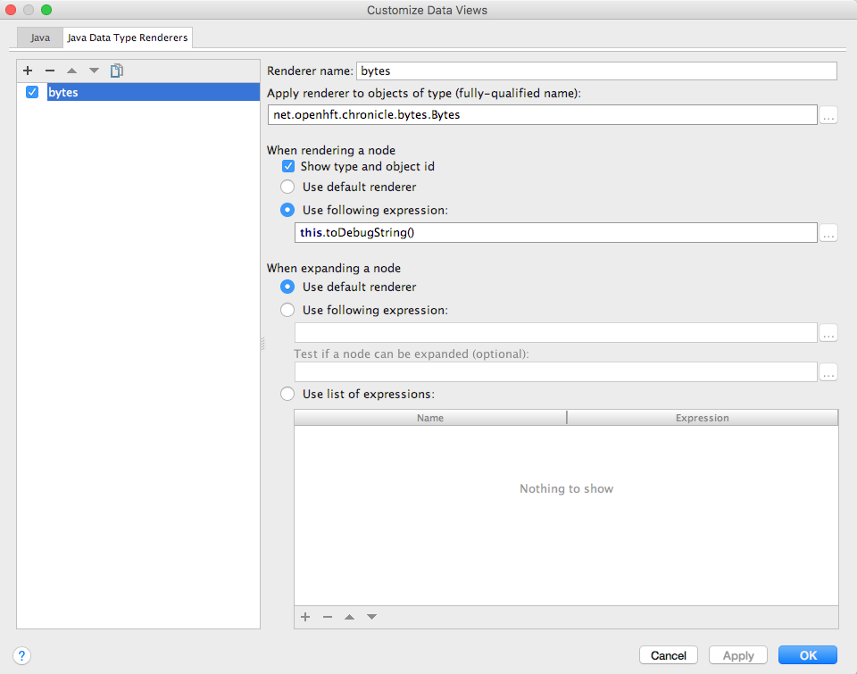

= Chronicle-Bytes

// GitHub customization
ifdef::env-github[]
:badges:
endif::[]

// Badges
ifdef::badges[]
image:https://maven-badges.herokuapp.com/maven-central/net.openhft/chronicle-bytes/badge.svg["Maven Central",link="https://maven-badges.herokuapp.com/maven-central/>net.openhft/chronicle-bytes"]
endif::[]

:css-signature: demo
:toc: macro
:toc-placement!:
:icons:
:source-highlighter: highlight

=== Chronicle-Bytes

toc::[]

Chronicle Bytes contains all the low level memory access wrappers.  It is built on Chronicle Core's direct memory and OS system call access.

Chronicle Bytes has a similar purpose to Java NIO's ByteBuffer with some extensions.

The API supports.

 - 64-bit sizes
 - UTF-8 and ISO-8859-1 encoded strings.
 - thread safe off heap memory operations.
 - deterministic release of resources via reference counting.
 - compressed data types such as stop bit encoding.
 - elastic ByteBuffer wrappers which resize as required.
 - parsing text and writing text directly to off heap bytes.

=== Data types supported

|===
| operation	| Indexed or streaming	| binary	| text
| read/write binary primitives	| both	| float, double, boolean and unsigned/signed byte, short, 24-bit int, int, long, incompleteLong	| double, int, long, char, double with precision
| read/write text	| both	| 8-bit/UTF-8 string with length or limit	| 8-bit/UTF-8 string
| read/write other	| streaming	| histogram, named enum	| bigdecimal, biginteger, date/time/zone, UUID, hexadecimal
| data driven tests	| from files	| no	| yes
| CAS	| indexed	| byte, short, int, long, float, double	|
| volatile read/write	| indexed	| byte, short, int, long, float, double	|
| peek	| both	| unsigned byte	|
| stop bit compression	| streaming	| int,long, double, float, char	|
| search	| from start	| indexOf string, findByte	|
| addAndGet	| indexed	| float, double, int, long	|
| copy	| from start	| write, copy	|
| hash	| from start	| byteSum, fastHash	|
| bytes marshallable	| streaming	| nested data structures, expected types only.	|
|===

=== Creating Bytes

.Bytes which wraps an on heap ByteBuffer
[source, Java]
----
Bytes<ByteBuffer> bytes = Bytes.elasticHeapByteBuffer(64);
ByteBuffer bb = bytes.underlying();
----

.Bytes which wraps a direct ByteBuffer
[source, Java]
----
Bytes<ByteBuffer> bytes = Bytes.elasticByteBuffer(64);
ByteBuffer bb = bytes.underlying();
----

.Bytes which wraps some native memory
[source, Java]
----
Bytes bytes = Bytes.allocateElasticDirect(64);
long address = bytes.address();
bytes.release(); // when it can be freed.
----

.Bytes which will wrap some native memory when used
[source, Java]
----
Bytes bytes = Bytes.allocateElasticDirect();
// use the bytes
bytes.release(); // when it can be freed.
----

=== Flipping Bytes

ByteBuffer needs to be flipped to switch between reading and writing.

Bytes holds a read position and a write position allowing you to write and immediately read without flipping.

NOTE: The writePosition is the readLimit.

=== Writing to a Hexadecimal dump

Writing to a hexadecimal dump is useful for documenting the format for messages written.
We have used the hexadecimal dump here.

.Writing primitives as binary and dumping
[source, java]
----
// only used for documentation
HexDumpBytes bytes = new HexDumpBytes();
bytes.comment("true").writeBoolean(true);
bytes.comment("s8").writeByte((byte) 1);
bytes.comment("u8").writeUnsignedByte(2);
bytes.comment("s16").writeShort((short) 3);
bytes.comment("u16").writeUnsignedShort(4);
bytes.comment("char").writeUnsignedShort('5'); // char
bytes.comment("s24").writeInt24(-6_666_666);
bytes.comment("u24").writeUnsignedInt24(16_666_666);
bytes.comment("s32").writeInt(6);
bytes.comment("u32").writeUnsignedShort(7);
bytes.comment("s64").writeLong(8);
bytes.comment("f32").writeFloat(9);
bytes.comment("f64").writeDouble(10);

System.out.println(bytes.toHexString());
----

prints

----
59                                              # true
01                                              # s8
02                                              # u8
03 00                                           # s16
04 00                                           # u16
35                                              # char
56 46 9a                                        # s24
2a 50 fe                                        # u24
06 00 00 00                                     # s32
07 00 00 00                                     # u32
08 00 00 00 00 00 00 00                         # s64
00 00 10 41                                     # f32
00 00 00 00 00 00 24 40                         # f64
----

to read this data you can use

.Reading the primitive values above
[source, java]
----
boolean flag = bytes.readBoolean();
byte s8 = bytes.readByte();
int u8 = bytes.readUnsignedByte();
short s16 = bytes.readShort();
int u16 = bytes.readUnsignedShort();
char ch = bytes.readStopBitChar();
int s24 = bytes.readInt24();
long u24 = bytes.readUnsignedInt24();
int s32 = bytes.readInt();
long u32 = bytes.readUnsignedInt();
long s64 = bytes.readLong();
float f32 = bytes.readFloat();
double f64 = bytes.readDouble();
----

=== Writing and reading using offsets

Instead of streaming the data, sometimes you need to control the placement of data, possibly at random.

.Write and read primitive by offset
[source, Java]
----
Bytes<ByteBuffer> bytes = Bytes.elasticHeapByteBuffer(64);
bytes.writeBoolean(0, true);
bytes.writeByte(1, (byte) 1);
bytes.writeUnsignedByte(2, 2);
bytes.writeShort(3, (short) 3);
bytes.writeUnsignedShort(5, 4);
bytes.writeInt(7, 6);
bytes.writeUnsignedInt(11, 7);
bytes.writeLong(15, 8);
bytes.writeFloat(23, 9);
bytes.writeDouble(27, 10);
bytes.writePosition(35);

System.out.println(bytes.toHexString());

boolean flag = bytes.readBoolean(0);
byte s8 = bytes.readByte(1);
int u8 = bytes.readUnsignedByte(2);
short s16 = bytes.readShort(3);
int u16 = bytes.readUnsignedShort(5);
int s32 = bytes.readInt(7);
long u32 = bytes.readUnsignedInt(11);
long s64 = bytes.readLong(15);
float f32 = bytes.readFloat(23);
double f64 = bytes.readDouble(27);
----

prints

----
00000000 59 01 02 03 00 04 00 06  00 00 00 07 00 00 00 08 Y······· ········
00000010 00 00 00 00 00 00 00 00  00 10 41 00 00 00 00 00 ········ ··A·····
00000020 00 24 40                                         ·$@
----

NOTE: While HexDumpBytes supports the offset methods, you need to provide the offset in binary and the dump making it more complex to use.

==== Volatile read and ordered write

Chronicle Bytes supports variants of the write primitives which have a store barrier `writeOrderedXxxx`, and reads with a load barrier `readVolatileXxxx`

NOTE: write ordered doesn't stall the pipeline to wait for the write to occur, making it possible for a single thread to read an old value after the ordered write.

=== Working wth text

You can also write and read text to Bytes for low level, direct to native memory text processing.

.Writing primitives as text
[source, Java]
----
Bytes<ByteBuffer> bytes = Bytes.elasticHeapByteBuffer(64);
bytes.append(true).append('\n');
bytes.append(1).append('\n');
bytes.append(2L).append('\n');
bytes.append('3').append('\n');
bytes.append(4.1f).append('\n');
bytes.append(5.2).append('\n');
bytes.append(6.2999999, 3).append('\n');

System.out.println(bytes.toHexString());
----

prints

----
00000000 54 0a 31 0a 32 0a 33 0a  34 2e 31 0a 35 2e 32 0a T·1·2·3· 4.1·5.2·
00000010 36 2e 33 30 30 0a                                6.300·
----

.Reading primitives as text
[source, Java]
----
boolean flag = bytes.parseBoolean();
int s32 = bytes.parseInt();
long s64 = bytes.parseLong();
String ch = bytes.parseUtf8(StopCharTesters.SPACE_STOP);
float f32 = bytes.parseFloat();
double f64 = bytes.parseDouble();
double f64b = bytes.parseDouble();
----

NOTE: There are less methods for text as 8, 16 and 24 bit can use methods for `int`, Unsigned int can use the `long` method.

=== Reading and Writing Strings

Chronicle Bytes supports two encodings, ISO-8859-1 and UTF-8.
It also supports writing these as binary with a length prefix, and a string which should be terminated.
Bytes expects Strings to be read to a buffer for further processing, possibly with a String pool.

[source, Java]
----
HexDumpBytes bytes = new HexDumpBytes();
bytes.comment("write8bit").write8bit("£ 1");
bytes.comment("writeUtf8").writeUtf8("£ 1");
bytes.comment("append8bit").append8bit("£ 1").append('\n');
bytes.comment("appendUtf8").appendUtf8("£ 1").append('\n');

System.out.println(bytes.toHexString());
----

prints

----
03 a3 20 31                                     # write8bit
04 c2 a3 20 31                                  # writeUtf8
a3 20 31 0a                                     # append8bit
c2 a3 20 31 0a                                  # appendUtf8
----

[source, Java]
----
String a = bytes.read8bit();
String b = bytes.readUtf8();
String c = bytes.parse8bit(StopCharTesters.CONTROL_STOP);
String d = bytes.parseUtf8(StopCharTesters.CONTROL_STOP);
----

=== Compare and Set operation

In binary, you can atomically replace an `int` or `long` on condition that it is an expected value.

.Write two fields, remember where the `int` and `long` are
[source, Java]
----
HexDumpBytes bytes = new HexDumpBytes();

bytes.comment("s32").writeUtf8("s32");
long s32 = bytes.writePosition();
bytes.writeInt(0);

bytes.comment("s64").writeUtf8("s64");
long s64 = bytes.writePosition();
bytes.writeLong(0);

System.out.println(bytes.toHexString());
----

prints

----
03 73 33 32 00 00 00 00                         # s32
03 73 36 34 00 00 00 00 00 00 00 00             # s64
----

.CAS two fields
[source, Java]
----
assertTrue(bytes.compareAndSwapInt(s32, 0, Integer.MAX_VALUE));
assertTrue(bytes.compareAndSwapLong(s64, 0, Long.MAX_VALUE));

System.out.println(bytes.toHexString());
----

prints

----
03 73 33 32 ff ff ff 7f                         # s32
03 73 36 34 ff ff ff ff ff ff ff 7f             # s64
----

INFO: You might wonder, how is the hex dump updated as well as the binary? The `readPosition` actually holds the write position for both, which is why it has to be computed in this case.

=== Stop bit compression

Stop Bit encoding is one form of simple compression.  For each 7 bits set, a byte is used with the high bit set when there is another byte to write.

See https://github.com/OpenHFT/RFC/blob/master/Stop-Bit-Encoding/Stop-Bit-Encoding-1.0.adoc[Stop Bit Encoding RFC] for more details

.Writing with stop bit encoding
[source, Java]
----
HexDumpBytes bytes = new HexDumpBytes();

for (long i : new long[]{
        0, -1,
        127, -127,
        128, -128,
        1 << 14, 1 << 21,
        1 << 28, 1L << 35,
        1L << 42, 1L << 49,
        1L << 56, Long.MAX_VALUE,
        Long.MIN_VALUE}) {
    bytes.comment(i + "L").writeStopBit(i);
}

for (double d : new double[]{
        0.0,
        -0.0,
        1.0,
        1.0625,
        -128,
        -Double.MIN_NORMAL,
        Double.NEGATIVE_INFINITY,
        Double.NaN,
        Double.POSITIVE_INFINITY}) {
    bytes.comment(d + "").writeStopBit(d);
}

System.out.println(bytes.toHexString());
----

prints

----
00                                              # 0L
80 00                                           # -1L
7f                                              # 127L
fe 00                                           # -127L
80 01                                           # 128L
ff 00                                           # -128L
80 80 01                                        # 16384L
80 80 80 01                                     # 2097152L
80 80 80 80 01                                  # 268435456L
80 80 80 80 80 01                               # 34359738368L
80 80 80 80 80 80 01                            # 4398046511104L
80 80 80 80 80 80 80 01                         # 562949953421312L
80 80 80 80 80 80 80 80 01                      # 72057594037927936L
ff ff ff ff ff ff ff ff 7f                      # 9223372036854775807L
ff ff ff ff ff ff ff ff ff 00                   # -9223372036854775808L
00                                              # 0.0
40                                              # -0.0
9f 7c                                           # 1.0
9f fc 20                                        # 1.0625
e0 18                                           # -128.0
c0 04                                           # -2.2250738585072014E-308
ff 7c                                           # -Infinity
bf 7e                                           # NaN
bf 7c                                           # Infinity
----

To read these you need either `long x = bytes.readStopBit()` or `double d = bytes.readStopBitDouble()`

=== Comparison of access to native memory

|===
| Access | ByteBuffer | Netty IOBuffer  | Aeron UnsafeBuffer | Chronicle Bytes

| Read/write primitives in native memory
| yes
| yes
| yes
| yes

| Separate Mutable interfaces
| run time check
| run time check
|  yes
|  yes

| Read/Write UTF8 strings
|  no
|   no
| String
|  any CharSequence + Appendable

| Read/Write ISO-8859-1 strings
| no
| no
| ?
| any CharSequence + Appendable

| Support Endianness
| Big and Little
| Big and Little
| Big and Little
| Native only

| Size of buffer
| 31-bit
| 31-bit
| 31-bit
| 63-bit

| Elastic ByteBuffers
| no
| yes
| no
| yes

| Disable bounds checks
| no
| no
| set globally
| by buffer

| Wrap an address
| no
| no
| yes
| yes

| Thread safe read/write, CAS and atomic add operations
| no
| no
| int; long
| int; long; float and double

| Streaming access
| yes
| yes
| no
| yes

| Deterministic release of memory
| Internal API
| Internal API
| Caller's responsibility
| yes

| Separate read and write position
| no
| yes
| na
| yes
|===

=== View Chronicle-Bytes in the debugger

When using intellij idea, you can set up a custom render to view the bytes, see the images below :

image::images/customize-data-views-menu.tiff[]

