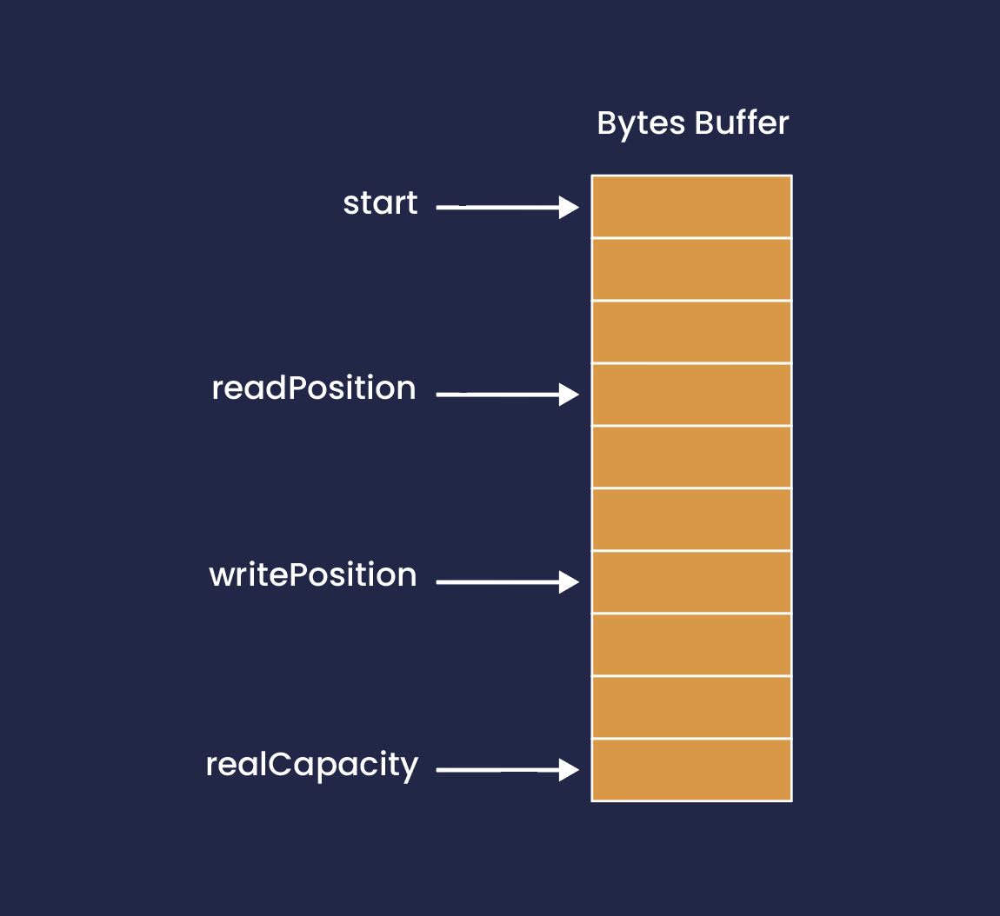

= Chronicle Bytes
Chronicle Software
:css-signature: demo
:toc: macro
:toclevels: 2
:icons: font

image:https://maven-badges.herokuapp.com/maven-central/net.openhft/chronicle-bytes/badge.svg[caption="",link=https://maven-badges.herokuapp.com/maven-central/net.openhft/chronicle-bytes]
image:https://javadoc.io/badge2/net.openhft/chronicle-bytes/javadoc.svg[link="https://www.javadoc.io/doc/net.openhft/chronicle-bytes/latest/index.html"]
//image:https://javadoc-badge.appspot.com/net.openhft/chronicle-bytes.svg?label=javadoc[JavaDoc, link=https://www.javadoc.io/doc/net.openhft/chronicle-bytes]
image:https://img.shields.io/github/license/OpenHFT/Chronicle-Bytes[GitHub]
image:https://img.shields.io/badge/release%20notes-subscribe-brightgreen[link="https://chronicle.software/release-notes/"]
image:https://sonarcloud.io/api/project_badges/measure?project=OpenHFT_Chronicle-Bytes&metric=alert_status[link="https://sonarcloud.io/dashboard?id=OpenHFT_Chronicle-Bytes"]

toc::[]

== About

Chronicle Bytes contains all the low level memory access wrappers. It is built on Chronicle Core's direct memory and OS system call access.

Chronicle Bytes has a similar purpose to Java NIO's ByteBuffer with some extensions.

The API supports.

- 63-bit sizes
- UTF-8 and ISO-8859-1 encoded strings.
- thread safe off heap memory operations.
- deterministic release of resources via reference counting.
- compressed data types such as stop bit encoding.
- elastic ByteBuffer wrappers which resize as required.
- parsing text and writing text directly to off heap bytes.

=== Data types supported

|===
| operation    | Indexed or streaming    | binary    | text
| read/write binary primitives    | both    | float, double, boolean and unsigned/signed byte, short, 24-bit int, int, long, incompleteLong    | double, int, long, char, double with precision
| read/write text    | both    | 8-bit/UTF-8 string with length or limit    | 8-bit/UTF-8 string
| read/write other    | streaming    | histogram, named enum    | bigdecimal, biginteger, date/time/zone, UUID, hexadecimal
| data driven tests    | from files    | no    | yes
| CAS    | indexed    | int, long    |
| volatile read/write    | indexed    | byte, short, int, long, float, double    |
| peek    | both    | unsigned byte    |
| stop bit compression    | streaming    | int,long, double, float, char    |
| search    | from start    | indexOf string, findByte    |
| addAndGet    | indexed    | float, double, int, long    |
| copy    | from start    | write, copy    |
| hash    | from start    | byteSum, fastHash    |
| bytes marshallable    | streaming    | nested data structures, expected types only.    |
|===

=== Data types explained

|===
| operation    |  explained |
| read/write binary primitives    |  to read an write primitive data stuctures stored in a binary from |
| read/write text    | to read an write text data |
| read/write other    | to read an write other data |
| data driven tests    | https://en.wikipedia.org/wiki/Data-driven_testing |
| CAS    | an atomic instruction used in multithreading to achieve synchronization. It compares the contents of a memory location with a given value and, only if they are the same, modifies the contents of that memory location to a new given value. |
| volatile read/write    |  http://tutorials.jenkov.com/java-concurrency/volatile.html |
| peek    |  peek is an operation which returns the value of the bytes without effecting its read position |
| stop bit compression    |  https://github.com/OpenHFT/RFC/tree/master/Stop-Bit-Encoding |
| search    |  is any algorithm which solves the search problem, namely, to retrieve information stored within some data structure |
| addAndGet    | atomically adds the given value to the current value. |
| copy    | to transfer data from one structure to another |
| hash    |  https://en.wikipedia.org/wiki/Hash_function    |
| bytes marshallable    |  a serialization function    |
|===

=== Creating Bytes

.Bytes which wraps an on heap byte[]
[source,Java]
----
Bytes<byte[]> bytes = Bytes.allocateElasticOnHeap();
byte[] = bytes.underlyingObject();
----

.Bytes which wraps an on heap byte[] pre-sized
[source,Java]
----
Bytes<byte[]> bytes = Bytes.allocateElasticOnHeap(64);
byte[] = bytes.underlyingObject();
----

.Bytes which wraps an on heap ByteBuffer
[source,Java]
----
Bytes<ByteBuffer> bytes = Bytes.elasticHeapByteBuffer(64);
ByteBuffer bb = bytes.underlyingObject();
----

.Bytes which wraps a direct ByteBuffer
[source,Java]
----
Bytes<ByteBuffer> bytes = Bytes.elasticByteBuffer(64);
ByteBuffer bb = bytes.underlyingObject();

bytes.releaseLast(); // when it can be freed.
----

.Bytes which wraps some native memory
[source,Java]
----
Bytes bytes = Bytes.allocateElasticDirect(64);
long address = bytes.address

bytes.releaseLast(); // when it can be freed.
----

.Bytes which will wrap some native memory when used
[source,Java]
----
Bytes bytes = Bytes.allocateElasticDirect();
// use the bytes

bytes.releaseLast(); // when it can be freed.
----

=== Bytes capacity, read/write position and limit

A Bytes buffer provides the following cursors.

- start: The smallest index in the buffer which is '0L'.
- capacity: The largest possible capacity for the buffer which is usually 2147483632 (it can be more) for a Bytes buffer.
- realCapacity: The current capacity of the buffer.
Bytes are extended when it is required.
- readLimit: The largest index that can be read from.
- writeLimit: The largest index that can be written to.
- readPosition: The index to read from.
This index should be always smaller than writePosition.
- writePosition: The index to write to.

[#img-Bytes]
.An illustration of a Bytes buffer with its read/write position cursors.

Figure 1 illustrates a Bytes buffer with read/write cursors. `readPosition` should always be
less than `writePosition` and greater than or equal to `start`.

=== BytesStore
BytesStore is a block of memory with fixed size into which you can write data and later read.
You can create a BytesStore using the bytes in a CharSequence, String, ByteBuffer or another
BytesStore.

[source,Java]
----
//Create a BytesStore bs using bytes in a String. This gives you a BytesStore with
//fixed size 18.
BytesStore bs = BytesStore.from("This is an example");

//or
//Create a BytesStore from ByteBuffer
ByteBuffer buf = ByteBuffer.allocate(20);
BytesStore bs2 = BytesStore.wrap(buf);
----
You can see the buffer cursors of bs.

[source,Java]
----
//Print cursors of bs.
System.out.println("readLimit  " + bs.readLimit());
System.out.println("writeLimit " + bs.writeLimit());
System.out.println("readPosition " + bs.readPosition());
System.out.println("writePosition " + bs.writePosition());
System.out.println("capacity " + bs.capacity());
System.out.println("realCapacity " + bs.realCapacity());
System.out.println("start " + bs.start());
----

prints

[source,text]
----
readLimit  18
writeLimit 18
readPosition 0
writePosition 0
capacity 18
realCapacity 18
start 0
----
You can write into a BytesStore from an offset, however if your data is larger than the
capacity of BytesStore, the ByteStore will not extend.

NOTE: The returned object (BytesStore) is unchecked in terms of memory access, therefore the user code
must make every effort not to exceed the underlying memory segment limit. Otherwise, the result is
unspecified side effects including silently writing over other memory segments, and crashing the JVM.

[source,Java]
----
//Write String "Another example.." into bs starting from offset 0.
bs.writeUtf8(0,"Another example..");

//Prints out: "Another example.."
System.out.println( bs.to8bitString());
----

==== Bytes versus BytesStore
- In contrast to a BytesStore, a Bytes extends if you write data into it which is larger than the
realCapacity of the Bytes.

[source,Java]
----
//Create a Bytes with initial capacity 14 and write into it "This is an example" that
//needs 18 bytes.
Bytes<byte[]> bb = Bytes.allocateElasticOnHeap(14);
bb.write("This is an example");
----
The realCapacity of bb extends to 4096. Now, the cursors of bb Bytes are:

[source,text]
----
readLimit  18
writeLimit 2147483632
readPosition 0
writePosition 18
capacity 2147483632
realCapacity 4096
start 0
----
- Bytes gives you access to the cursors, thus you can use them to read/write from/into a
desired index. In contrast, you cannot use the cursors with a BytesStore.

[source,Java]
----
//Write another data starting from index 5 which needs more bytes therefore bb extends.
bb.writePosition(5);
bb.write("sentence was overwritten from index 5 using writePosition cursor");

//Prints out: "This sentence was overwritten from index 5 using writePosition cursor"
System.out.println(by.toString());

//Read bb from index 43
bb.readPosition(43);
String st = bb.to8bitString();

//Prints out: "using writePosition cursor"
System.out.println(st);
----

- In contrast to Bytes, BytesStore can be shared safely across threads provided that the referenced
data is accessed in a thread-safe manner.

=== bytesForRead() and bytesForWrite()
The `bytesForRead()` and `bytesForWrite()` methods can be used to create Bytes from a section of a BytesStore or a Bytes. The size of the new Bytes depends on the `limit` and `position` cursors of the original Object.

- Create bytesForRead/Write From BytesStore:

. When you use bytesForWrite() `readLimit` and `writePosition` cursors are set to `start`.

. When you use bytesForRead(), `readPosition` is set to `start`, and `readLimit` and `writePosition` cursors are set to `realCapacity`.

The new Bytes is not elastic and whether you use bytesForRead() or bytesForWrite() you can read and write from/into the new Bytes using cursors.

[source,Java]
----
//Create a BytesStore bs using bytes in a String.
BytesStore bs = BytesStore.from("This is an example");

//Create a Bytes from bs using bytesForRead().
Bytes bfr = bs.bytesForRead();

//Create a Bytes from bs using bytesForwrite().
Bytes bfw = bs.bytesForWrite();
----
The cursors of bs:
[source,text]
----
readLimit  18
writeLimit 18
readPosition 0
writePosition 0
capacity 18
realCapacity 18
start 0
----

The cursors of bfr:

[source,text]
----
readLimit  18
writeLimit 18
readPosition 0
writePosition 18
capacity 18
realCapacity 18
start 0
----
The cursors of bfw:

[source,text]
----
readLimit  0
writeLimit 18
readPosition 0
writePosition 0
capacity 18
realCapacity 18
start 0
----

- Create bytesForRead/Write from a Bytes:
. When you use bytesForWrite() `writeLimit` is set to `capacity` and the new Bytes is elastic.

. When you use bytesForRead() `readPosition` is set to `start`, and `writeLimit` is set to `realCapacity` and the new Bytes is *not* elastic.

Regardless if bytesForRead() or bytesForWrite() is used, you can both read and write from/into the new Bytes using cursors.
[source,Java]
----
//Create a Bytes bb with default size (256 bytes) and write a text into it.
Bytes<ByteBuffer> bb = Bytes.elasticByteBuffer();
bb.write("This is an example");

//Create a Bytes bfr2 from bb using bytesForRead().
Bytes bfr2 = bb.bytesForRead();

//Create a Bytes bfw2 from bb using bytesForWrite().
Bytes bfw2 = bb.bytesForWrite();
----

The cursors of bb:

[source,text]
----
readLimit  18
writeLimit 2147483632
readPosition 0
writePosition 18
capacity 2147483632
realCapacity 256
start 0
----
The cursors of bfr2:

[source,text]
----
readLimit  18
writeLimit 256
readPosition 0
writePosition 18
capacity 2147483632
realCapacity 256
start 0
----
The cursors of bfw2:

[source,text]
----
readLimit  18
writeLimit 2147483632
readPosition 0
writePosition 18
capacity 2147483632
realCapacity 256
start 0
----

=== Flipping Bytes

The standard Java `ByteBuffer` needs to be flipped to switch between reading and writing.

Bytes holds a read position and a write position allowing you to write and immediately read without flipping.

NOTE: The writePosition is the readLimit.

=== Writing to a Hexadecimal dump

Writing to a hexadecimal dump is useful for documenting the format for messages written.
We have used the hexadecimal dump here.

.Writing primitives as binary and dumping
[source, java]
----
// only used for documentation
HexDumpBytes bytes = new HexDumpBytes();
bytes.comment("true").writeBoolean(true);
bytes.comment("s8").writeByte((byte) 1);
bytes.comment("u8").writeUnsignedByte(2);
bytes.comment("s16").writeShort((short) 3);
bytes.comment("u16").writeUnsignedShort(4);
bytes.comment("char").writeUnsignedShort('5'); // char
bytes.comment("s24").writeInt24(-6_666_666);
bytes.comment("u24").writeUnsignedInt24(16_666_666);
bytes.comment("s32").writeInt(6);
bytes.comment("u32").writeUnsignedShort(7);
bytes.comment("s64").writeLong(8);
bytes.comment("f32").writeFloat(9);
bytes.comment("f64").writeDouble(10);

System.out.println(bytes.toHexString());
----

prints

----
59                                              # true
01                                              # s8
02                                              # u8
03 00                                           # s16
04 00                                           # u16
35                                              # char
56 46 9a                                        # s24
2a 50 fe                                        # u24
06 00 00 00                                     # s32
07 00 00 00                                     # u32
08 00 00 00 00 00 00 00                         # s64
00 00 10 41                                     # f32
00 00 00 00 00 00 24 40                         # f64
----

to read this data you can use

.Reading the primitive values above
[source, java]
----
boolean flag = bytes.readBoolean();
byte s8 = bytes.readByte();
int u8 = bytes.readUnsignedByte();
short s16 = bytes.readShort();
int u16 = bytes.readUnsignedShort();
char ch = bytes.readStopBitChar();
int s24 = bytes.readInt24();
long u24 = bytes.readUnsignedInt24();
int s32 = bytes.readInt();
long u32 = bytes.readUnsignedInt();
long s64 = bytes.readLong();
float f32 = bytes.readFloat();
double f64 = bytes.readDouble();
----

=== Writing and reading using offsets

Instead of streaming the data, sometimes you need to control the placement of data, possibly at random.

.Write and read primitive by offset
[source, Java]
----
Bytes<ByteBuffer> bytes = Bytes.elasticHeapByteBuffer(64);
bytes.writeBoolean(0, true);
bytes.writeByte(1, (byte) 1);
bytes.writeUnsignedByte(2, 2);
bytes.writeShort(3, (short) 3);
bytes.writeUnsignedShort(5, 4);
bytes.writeInt(7, 6);
bytes.writeUnsignedInt(11, 7);
bytes.writeLong(15, 8);
bytes.writeFloat(23, 9);
bytes.writeDouble(27, 10);
bytes.writePosition(35);

System.out.println(bytes.toHexString());

boolean flag = bytes.readBoolean(0);
byte s8 = bytes.readByte(1);
int u8 = bytes.readUnsignedByte(2);
short s16 = bytes.readShort(3);
int u16 = bytes.readUnsignedShort(5);
int s32 = bytes.readInt(7);
long u32 = bytes.readUnsignedInt(11);
long s64 = bytes.readLong(15);
float f32 = bytes.readFloat(23);
double f64 = bytes.readDouble(27);
----

prints

----
00000000 59 01 02 03 00 04 00 06  00 00 00 07 00 00 00 08 Y······· ········
00000010 00 00 00 00 00 00 00 00  00 10 41 00 00 00 00 00 ········ ··A·····
00000020 00 24 40                                         ·$@
----

NOTE: While HexDumpBytes supports the offset methods, you need to provide the offset in binary and the dump making it more complex to use.

==== Volatile read and ordered write

Chronicle Bytes supports variants of the write primitives which have a store barrier `writeOrderedXxxx`, and reads with a load barrier `readVolatileXxxx`

NOTE: write ordered doesn't stall the pipeline to wait for the write to occur, making it possible for a single thread to read an old value after the ordered write.

=== Working with text

You can also write and read text to Bytes for low level, direct to native memory text processing.

.Writing primitives as text
[source, Java]
----
Bytes<ByteBuffer> bytes = Bytes.elasticHeapByteBuffer(64);
bytes.append(true).append('\n');
bytes.append(1).append('\n');
bytes.append(2L).append('\n');
bytes.append('3').append('\n');
bytes.append(4.1f).append('\n');
bytes.append(5.2).append('\n');
bytes.append(6.2999999, 3).append('\n');

System.out.println(bytes.toHexString());
----

prints

----
00000000 54 0a 31 0a 32 0a 33 0a  34 2e 31 0a 35 2e 32 0a T·1·2·3· 4.1·5.2·
00000010 36 2e 33 30 30 0a                                6.300·
----

.Reading primitives as text
[source, Java]
----
boolean flag = bytes.parseBoolean();
int s32 = bytes.parseInt();
long s64 = bytes.parseLong();
String ch = bytes.parseUtf8(StopCharTesters.SPACE_STOP);
float f32 = bytes.parseFloat();
double f64 = bytes.parseDouble();
double f64b = bytes.parseDouble();
----

NOTE: There are fewer methods for text as 8, 16 and 24 bit can use methods for `int`, Unsigned int can use the `long` method.

=== Reading and Writing Strings

Chronicle Bytes supports two encodings, ISO-8859-1 and UTF-8.
It also supports writing these as binary with a length prefix, and a string which should be terminated.
Bytes expects Strings to be read to a buffer for further processing, possibly with a String pool.

[source, Java]
----
HexDumpBytes bytes = new HexDumpBytes();
bytes.comment("write8bit").write8bit("£ 1");
bytes.comment("writeUtf8").writeUtf8("£ 1");
bytes.comment("append8bit").append8bit("£ 1").append('\n');
bytes.comment("appendUtf8").appendUtf8("£ 1").append('\n');

System.out.println(bytes.toHexString());
----

prints

----
03 a3 20 31                                     # write8bit
04 c2 a3 20 31                                  # writeUtf8
a3 20 31 0a                                     # append8bit
c2 a3 20 31 0a                                  # appendUtf8
----

[source, Java]
----
String a = bytes.read8bit();
String b = bytes.readUtf8();
String c = bytes.parse8bit(StopCharTesters.CONTROL_STOP);
String d = bytes.parseUtf8(StopCharTesters.CONTROL_STOP);
----

Binary strings are prefixed with a https://github.com/OpenHFT/RFC/blob/master/Stop-Bit-Encoding/Stop-Bit-Encoding-1.0.adoc[Stop Bit Encoded] length.

[source, Java]
----
HexDumpBytes bytes = new HexDumpBytes();
bytes.comment("write8bit").write8bit((String) null);
bytes.comment("writeUtf8").writeUtf8(null);

System.out.println(bytes.toHexString());

String a = bytes.read8bit();
String b = bytes.readUtf8();
assertEquals(null, a);
assertEquals(null, b);
----

prints

----
80 00                                           # write8bit
80 00                                           # writeUtf8
----

NOTE: `80 00` is the stop bit encoding for `-1` or `~0`

=== Compare and Set operation

In binary, you can atomically replace an `int` or `long` on condition that it is an expected value.

.Write two fields, remember where the `int` and `long` are
[source, Java]
----
HexDumpBytes bytes = new HexDumpBytes();

bytes.comment("s32").writeUtf8("s32");
long s32 = bytes.writePosition();
bytes.writeInt(0);

bytes.comment("s64").writeUtf8("s64");
long s64 = bytes.writePosition();
bytes.writeLong(0);

System.out.println(bytes.toHexString());
----

prints

----
03 73 33 32 00 00 00 00                         # s32
03 73 36 34 00 00 00 00 00 00 00 00             # s64
----

.CAS two fields
[source, Java]
----
assertTrue(bytes.compareAndSwapInt(s32, 0, Integer.MAX_VALUE));
assertTrue(bytes.compareAndSwapLong(s64, 0, Long.MAX_VALUE));

System.out.println(bytes.toHexString());
----

prints

----
03 73 33 32 ff ff ff 7f                         # s32
03 73 36 34 ff ff ff ff ff ff ff 7f             # s64
----

INFO: You might wonder, how is the hex dump updated as well as the binary? The `readPosition` actually holds the write position for both, which is why it has to be computed in this case.

=== Stop bit compression

Stop Bit encoding is one form of simple compression.  For each 7 bits set, a byte is used with the high bit set when there is another byte to write.

See https://github.com/OpenHFT/RFC/blob/master/Stop-Bit-Encoding/Stop-Bit-Encoding-1.0.adoc[Stop Bit Encoding RFC] for more details

.Writing with stop bit encoding
[source, Java]
----
HexDumpBytes bytes = new HexDumpBytes();

for (long i : new long[]{
        0, -1,
        127, -127,
        128, -128,
        1 << 14, 1 << 21,
        1 << 28, 1L << 35,
        1L << 42, 1L << 49,
        1L << 56, Long.MAX_VALUE,
        Long.MIN_VALUE}) {
    bytes.comment(i + "L").writeStopBit(i);
}

for (double d : new double[]{
        0.0,
        -0.0,
        1.0,
        1.0625,
        -128,
        -Double.MIN_NORMAL,
        Double.NEGATIVE_INFINITY,
        Double.NaN,
        Double.POSITIVE_INFINITY}) {
    bytes.comment(d + "").writeStopBit(d);
}

System.out.println(bytes.toHexString());
----

prints

----
00                                              # 0L
80 00                                           # -1L
7f                                              # 127L
fe 00                                           # -127L
80 01                                           # 128L
ff 00                                           # -128L
80 80 01                                        # 16384L
80 80 80 01                                     # 2097152L
80 80 80 80 01                                  # 268435456L
80 80 80 80 80 01                               # 34359738368L
80 80 80 80 80 80 01                            # 4398046511104L
80 80 80 80 80 80 80 01                         # 562949953421312L
80 80 80 80 80 80 80 80 01                      # 72057594037927936L
ff ff ff ff ff ff ff ff 7f                      # 9223372036854775807L
ff ff ff ff ff ff ff ff ff 00                   # -9223372036854775808L
00                                              # 0.0
40                                              # -0.0
9f 7c                                           # 1.0
9f fc 20                                        # 1.0625
e0 18                                           # -128.0
c0 04                                           # -2.2250738585072014E-308
ff 7c                                           # -Infinity
bf 7e                                           # NaN
bf 7c                                           # Infinity
----

To read these you need either `long x = bytes.readStopBit()` or `double d = bytes.readStopBitDouble()`

=== BytesMarshallable objects

Chronicle Bytes supports serializing simple objects where the type is not stored.  This is similar to`RawWire` in Chronicle Wire.

[source, Java]
----
@NotNull MyByteable mb1 = new MyByteable(false, (byte) 1, (short) 2, '3', 4, 5.5f, 6, 7.7);
@NotNull MyByteable mb2 = new MyByteable(true, (byte) 11, (short) 22, 'T', 44, 5.555f, 66, 77.77);
ZonedDateTime zdt1 = ZonedDateTime.parse("2017-11-06T12:35:56.775Z[Europe/London]");
ZonedDateTime zdt2 = ZonedDateTime.parse("2016-10-05T01:34:56.775Z[Europe/London]");
UUID uuid1 = new UUID(0x123456789L, 0xABCDEF);
UUID uuid2 = new UUID(0x1111111111111111L, 0x2222222222222222L);
@NotNull MyScalars ms1 = new MyScalars("Hello", BigInteger.ONE, BigDecimal.TEN, zdt1.toLocalDate(), zdt1.toLocalTime(), zdt1.toLocalDateTime(), zdt1, uuid1);
@NotNull MyScalars ms2 = new MyScalars("World", BigInteger.ZERO, BigDecimal.ZERO, zdt2.toLocalDate(), zdt2.toLocalTime(), zdt2.toLocalDateTime(), zdt2, uuid2);
@NotNull MyNested mn1 = new MyNested(mb1, ms1);
@NotNull MyNested mn2 = new MyNested(mb2, ms2);
bytes.comment("mn1").writeUnsignedByte(1);
mn1.writeMarshallable(bytes);
bytes.comment("mn2").writeUnsignedByte(2);
mn2.writeMarshallable(bytes);
----

.MyByteable data structure
[source, Java]
----
class MyByteable implements BytesMarshallable {
    boolean flag;
    byte b;
    short s;
    char c;
    int i;
    float f;
    long l;
    double d;

    public MyByteable(boolean flag, byte b, short s, char c, int i, float f, long l, double d) {
        this.flag = flag;
        this.b = b;
        this.s = s;
        this.c = c;
        this.i = i;
        this.f = f;
        this.l = l;
        this.d = d;
    }
----

.MyScalars data structure
[source, Java]
----
class MyScalars implements BytesMarshallable {
    String s;
    BigInteger bi;
    BigDecimal bd;
    LocalDate date;
    LocalTime time;
    LocalDateTime dateTime;
    ZonedDateTime zonedDateTime;
    UUID uuid;

    public MyScalars(String s, BigInteger bi, BigDecimal bd, LocalDate date, LocalTime time, LocalDateTime dateTime, ZonedDateTime zonedDateTime, UUID uuid) {
        this.s = s;
        this.bi = bi;
        this.bd = bd;
        this.date = date;
        this.time = time;
        this.dateTime = dateTime;
        this.zonedDateTime = zonedDateTime;
        this.uuid = uuid;
    }
----

prints

----
01                                              # mn1
                                                # byteable
      4e                                              # flag
      01                                              # b
      02 00                                           # s
      33                                              # c
      04 00 00 00                                     # i
      00 00 b0 40                                     # f
      06 00 00 00 00 00 00 00                         # l
      cd cc cc cc cc cc 1e 40                         # d
                                                # scalars
      05 48 65 6c 6c 6f                               # s
      01 31                                           # bi
      02 31 30                                        # bd
      0a 32 30 31 37 2d 31 31 2d 30 36                # date
      0c 31 32 3a 33 35 3a 35 36 2e 37 37 35          # time
      17 32 30 31 37 2d 31 31 2d 30 36 54 31 32 3a 33 # dateTime
      35 3a 35 36 2e 37 37 35 27 32 30 31 37 2d 31 31 # zonedDateTime
      2d 30 36 54 31 32 3a 33 35 3a 35 36 2e 37 37 35
      5a 5b 45 75 72 6f 70 65 2f 4c 6f 6e 64 6f 6e 5d # uuid
      24 30 30 30 30 30 30 30 31 2d 32 33 34 35 2d 36
      37 38 39 2d 30 30 30 30 2d 30 30 30 30 30 30 61
      62 63 64 65 66
02                                              # mn2
                                                # byteable
      59                                              # flag
      0b                                              # b
      16 00                                           # s
      54                                              # c
      2c 00 00 00                                     # i
      8f c2 b1 40                                     # f
      42 00 00 00 00 00 00 00                         # l
      e1 7a 14 ae 47 71 53 40                         # d
                                                # scalars
      05 57 6f 72 6c 64                               # s
      01 30                                           # bi
      01 30                                           # bd
      0a 32 30 31 36 2d 31 30 2d 30 35                # date
      0c 30 31 3a 33 34 3a 35 36 2e 37 37 35          # time
      17 32 30 31 36 2d 31 30 2d 30 35 54 30 31 3a 33 # dateTime
      34 3a 35 36 2e 37 37 35 2c 32 30 31 36 2d 31 30 # zonedDateTime
      2d 30 35 54 30 31 3a 33 34 3a 35 36 2e 37 37 35
      2b 30 31 3a 30 30 5b 45 75 72 6f 70 65 2f 4c 6f
      6e 64 6f 6e 5d 24 31 31 31 31 31 31 31 31 2d 31 # uuid
      31 31 31 2d 31 31 31 31 2d 32 32 32 32 2d 32 32
      32 32 32 32 32 32 32 32 32 32
----

== Data driven tests

The purpose of a Lambda function is to create a simple, highly reproducible, easily testable component.

Once you have your data dumped as hexadecimal, you can create tests using that data, and make variations of those tests.

=== What do we mean by a Lambda function?

In this context a Lambda function is one which is entirely input driven and produces a list of messages (one or more outputs).

The simplest Lambda function is stateless, however this has limited application. They are useful for message translation.

If you need a stateful Lambda function, you can consider the input to the function to be every message it has ever consumed.
Obviously this is inefficient, however with appropriate caches in your lamdba function, you can process and produce result incrementally.

=== Data in and out.

We module a Lambda function as having an interface for inputs and another for outputs. These interfaces can be the same.

.Sample interface for Lambda function
[source, Java]
----
interface IBytesMethod {
    @MethodId(0x81L) // <1>
    void myByteable(MyByteable byteable);

    @MethodId(0x82L)
    void myScalars(MyScalars scalars);

    @MethodId(0x83L)
    void myNested(MyNested nested);
}
----
<1> assign a unique id to each method to simplify decoding/encoding.

Each method needs a DTO to describe the data for that message.

[source, Java]
----
class MyByteable implements BytesMarshallable {
    boolean flag;
    byte b;
    short s;
    char c;
    int i;
    float f;
    long l;
    double d;
....
class MyScalars implements BytesMarshallable {
    String s;
    BigInteger bi;
    BigDecimal bd;
    LocalDate date;
    LocalTime time;
    LocalDateTime dateTime;
    ZonedDateTime zonedDateTime;
    UUID uuid;
....
class MyNested implements BytesMarshallable {
    MyByteable byteable;
    MyScalars scalars;
....
----

The implementation needs to take it's output interface and implement the input interface

.A simple pass through implementation
[source, Java]
----
static class IBMImpl implements IBytesMethod {
    final IBytesMethod out;

    IBMImpl(IBytesMethod out) { this.out = out; }

    @Override
    public void myByteable(MyByteable byteable) { out.myByteable(byteable); }

    @Override
    public void myScalars(MyScalars scalars) { out.myScalars(scalars); }

    @Override
    public void myNested(MyNested nested) { out.myNested(nested); }
}

----

Once we have interfaces, DTOs, and an implementation we can setup a test harness

.Setup a test harness for a Lambda function
[source, Java]
----
protected void btmttTest(String input, String output)
throws IOException {
    BytesTextMethodTester tester = new BytesTextMethodTester<>(
            input,
            IBMImpl::new,
            IBytesMethod.class,
            output);
    tester.run();
    assertEquals(tester.expected(), tester.actual());
}
----

This allows us to give two files, one for expected inputs and one for expected outputs.

[source, Java]
----
@Test
public void run()
throws IOException {
    btmttTest("btmtt/prim-input.txt", "btmtt/prim-output.txt");
}
----

NOTE: In this case the input and outputs are expected to be the same.

.Sample input/output file
[source]
----
81 01                                           # myByteable
   4e                                              # flag
   01                                              # b
   02 00                                           # s
   33                                              # c
   04 00 00 00                                     # i
   00 00 b0 40                                     # f
   06 00 00 00 00 00 00 00                         # l
   cd cc cc cc cc cc 1e 40                         # d
### End Of Block
81 01                                           # myByteable
   59                                              # flag
   0b                                              # b
   16 00                                           # s
   54                                              # c
   2c 00 00 00                                     # i
   8f c2 b1 40                                     # f
   42 00 00 00 00 00 00 00                         # l
   e1 7a 14 ae 47 71 53 40                         # d
### End Of Block
82 01                                           # myScalars
   05 48 65 6c 6c 6f                               # s
   01 31                                           # bi
   02 31 30                                        # bd
   0a 32 30 31 37 2d 31 31 2d 30 36                # date
   0c 31 32 3a 33 35 3a 35 36 2e 37 37 35          # time
   17 32 30 31 37 2d 31 31 2d 30 36 54 31 32 3a 33 # dateTime
   35 3a 35 36 2e 37 37 35 27 32 30 31 37 2d 31 31 # zonedDateTime
   2d 30 36 54 31 32 3a 33 35 3a 35 36 2e 37 37 35
   5a 5b 45 75 72 6f 70 65 2f 4c 6f 6e 64 6f 6e 5d # uuid
   24 30 30 30 30 30 30 30 31 2d 32 33 34 35 2d 36
   37 38 39 2d 30 30 30 30 2d 30 30 30 30 30 30 61
   62 63 64 65 66
### End Of Block
83 01                                           # myNested
                                                # byteable
      59                                              # flag
      0b                                              # b
      16 00                                           # s
      54                                              # c
      2c 00 00 00                                     # i
      8f c2 b1 40                                     # f
      42 00 00 00 00 00 00 00                         # l
      e1 7a 14 ae 47 71 53 40                         # d
                                                # scalars
      05 57 6f 72 6c 64                               # s
      01 30                                           # bi
      01 30                                           # bd
      0a 32 30 31 36 2d 31 30 2d 30 35                # date
      0c 30 31 3a 33 34 3a 35 36 2e 37 37 35          # time
      17 32 30 31 36 2d 31 30 2d 30 35 54 30 31 3a 33 # dateTime
      34 3a 35 36 2e 37 37 35 2c 32 30 31 36 2d 31 30 # zonedDateTime
      2d 30 35 54 30 31 3a 33 34 3a 35 36 2e 37 37 35
      2b 30 31 3a 30 30 5b 45 75 72 6f 70 65 2f 4c 6f
      6e 64 6f 6e 5d 24 31 31 31 31 31 31 31 31 2d 31 # uuid
      31 31 31 2d 31 31 31 31 2d 32 32 32 32 2d 32 32
      32 32 32 32 32 32 32 32 32 32
### End Of Block
### End Of Test
----

In this case, the test calls the methods with the matching method ids which in turn uses the same ids to encode the output.

NOTE: Creating and maintain such tests can be an overhead you don't need. In this case, you can use Chronicle Wire's YAML testing format to check functionality. Wire can be used for most of the tests even if you intend to use Bytes for production.

=== Comparison of access to native memory

|===
| Access | ByteBuffer | Netty IOBuffer  | Aeron UnsafeBuffer | Chronicle Bytes

| Read/write primitives in native memory
| yes
| yes
| yes
| yes

| Separate Mutable interfaces
| run time check
| run time check
|  yes
|  yes

| Read/Write UTF8 strings
|  no
|   no
| String
|  any CharSequence + Appendable

| Read/Write ISO-8859-1 strings
| no
| no
| ?
| any CharSequence + Appendable

| Support Endianness
| Big and Little
| Big and Little
| Big and Little
| Native only

| Size of buffer
| 31-bit
| 31-bit
| 31-bit
| 63-bit

| Elastic ByteBuffers
| no
| yes
| no
| yes

| Disable bounds checks
| no
| no
| set globally
| by buffer

| Wrap an address
| no
| no
| yes
| yes

| Thread safe read/write, CAS and atomic add operations
| no
| no
| int; long
| int; long; float and double

| Streaming access
| yes
| yes
| no
| yes

| Deterministic release of memory
| Internal API
| Internal API
| Caller's responsibility
| yes

| Separate read and write position
| no
| yes
| na
| yes

| Sync to disk of memory mapped files
| no
| no
| no
| MS_ASYNC and MS_SYNC
|===

== Memory mapped files

Memory mapped files act as Bytes, growing as needed.
A chunk size is set to determine how much to grow by as more of the Bytes are used.
A `syncMode` can be set to flush data as each chunk is released.

.Open two MappedBytes for the same region of memory
[source,java]
----
// set the file name, chunk size, and overlap size of each chunk
try (MappedBytes bytesW = MappedBytes.mappedBytes(file, 64 << 10, 16 << 10);
        MappedBytes bytesR = MappedBytes.mappedBytes(file,  64 << 10, 16 << 10))
    {
        bytesW.syncMode(SyncMode.ASYNC); // asynchronously flush each chunk to disk
    }
----

Memory mapped files ware used by Chronicle Map and Chronicle Queue.

== View Chronicle-Bytes in the debugger

When using IntelliJ Idea, you can set up a custom renderer to view the bytes, see the images below :

image::/docs/images/customize-data-views-menu.jpg[]

image::/docs/images/customize-data-views.png[]

=== Performing code coverage

When performing code coverage, you might want to exclude `AbstractBytes` as this significantly slows down the running of unit tests.
